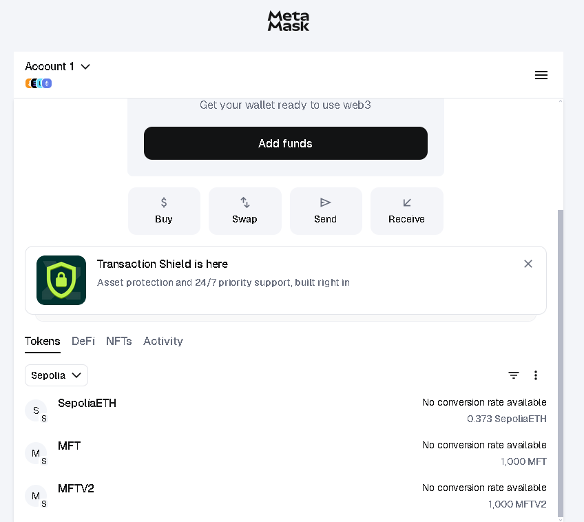
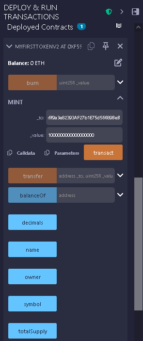
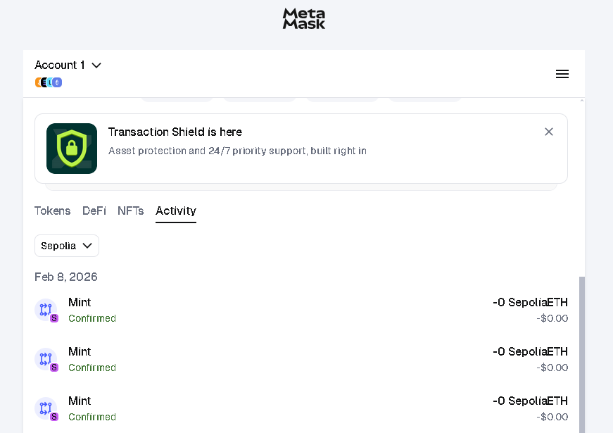

# My First Token (MFT)

My first blockchain project – a simple token written in Solidity.

This repository documents my learning journey into smart contracts
by building and improving a basic ERC-20–like token.

## Version 1 (V1)

The initial version of the token focuses on the fundamentals:

- Fixed total supply created in the constructor
- Token transfers between addresses
- Balance tracking using mappings
- Basic smart contract structure

This version was created to understand how tokens work at a low level.

## Version 2 (V2)

The second version extends the original token with additional features:

- Ownership (`owner`) and access control
- Owner-only minting of new tokens
- Token burning functionality for holders
- Better control over total supply

V2 represents the next step in learning Solidity
and smart contract design.

Version 3 (V3)

The third version upgrades the token to be fully compliant with the ERC-20.

New features added:

approve() function

allowance mapping

transferFrom() function

Approval event

Full ERC-20 compatibility

Additional edge case testing

This version allowed me to understand how delegated token transfers work and how DeFi protocols interact with tokens.

## What this project does

- Creates and manages a custom token
- Allows transfers between Ethereum addresses
- Demonstrates minting and burning logic
- Shows how access control works in smart contracts

## Tech Stack

- Solidity
- Ethereum (Sepolia testnet)
- Remix IDE
- MetaMask

## Why I Built This

To learn how smart contracts work by building real projects
instead of only following tutorials.

## Deployment (V1)

- Remix IDE: https://remix.ethereum.org
- Network: Sepolia testnet
- Deployed Contract Address (18 decimals ):  
  `0x224c19e181Af0BAc6B4a88004487A64756065ea9`

  Sepolia Etherscan:
  https://sepolia.etherscan.io/token/0x224c19e181Af0BAc6B4a88004487A64756065ea9

  ## Deployment (V2)

- Network: Sepolia testnet
- Token: My First Token (MFT)
- Token Contract Address (18 decimals):  
  `0xf59DC9a20Be6f9a3e82393AF27b1E75d56689BeB`

Sepolia Etherscan:
https://sepolia.etherscan.io/token/0xf59DC9a20Be6f9a3e82393AF27b1E75d56689BeB

## Proof of Deployment

Screenshots in the `/screenshots` folder show the MFT token
successfully deployed and visible in MetaMask.

### Token in MetaMask (V1)

## Proof of Deployment (V2)

### Token in MetaMask (V2)

### Contract Interaction in Remix (V2)

### Transactions Activity (V2)

## Disclaimer

This project is for educational purposes only  
and is not intended for production use.

## License

MIT
